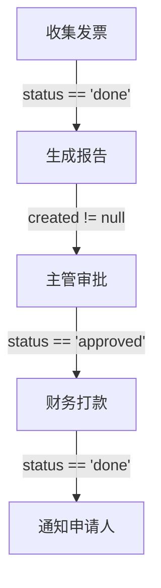

# SACP v1.2 规划文档

**规划日期**: 2026-03-20
**预计发布**: 两周后（2026-04-03）
**基于版本**: v1.1

---

## 📋 版本目标

SACP v1.2 将在 v1.1 的基础上，进一步增强工作流编排能力，重点解决**复杂业务逻辑表达**和**可视化体验**两大核心需求。

**核心主题**：
- 让工作流表达更强大的业务逻辑
- 让工作流更直观、易用、可调试

---

## 🎯 功能优先级

### P0 - 核心功能（必须有）

#### 1. 复杂触发条件表达式

**当前限制**（v1.1）：
- 只支持简单的单条件判断：`step1.status == 'done'`
- 无法表达"与"、"或"、"非"逻辑

**v1.2 目标**：
- 支持 AND/OR/NOT 逻辑运算符
- 支持括号分组
- 支持复杂嵌套表达式

**语法示例**：
```javascript
// 基础逻辑
"step1.status == 'done' AND step2.progress >= 50"
"step3.status == 'approved' OR step4.approver_count >= 2"

// 括号分组
"(priority == '高' OR priority == '紧急') AND status != 'cancelled'"

// 复杂嵌套
"(step1.status == 'done' AND step2.score > 80) OR (step3.fast_track == true)"

// NOT 运算
"NOT step4.errors CONTAINS 'timeout'"
```

**字段扩展**：
```json
{
  "id": "step5",
  "type": "schedule",
  "title": "安排会议",
  "trigger": "(step1.status == 'done' AND step2.confirmed == true) OR step3.urgent == true",
  "config": {...}
}
```

**实现细节**：
1. 定义表达式语法（类 SQL WHERE 子句）
2. 实现表达式解析器（支持递归下降解析）
3. 实现表达式求值引擎
4. 添加表达式验证和错误提示
5. 提供表达式测试工具

**技术方案**：
- 使用 ANTLR 或手写递归下降解析器
- 表达式 AST（抽象语法树）
- 安全的沙箱执行环境

---

### P1 - 重要功能（应该有）

#### 2. Workflow 可视化 DSL

**需求背景**：
- 用户需要直观地查看和理解工作流
- 非技术人员需要图形化界面
- 文档和演示需要流程图

**v1.2 目标**：
- 定义文本化的图形描述语言
- 支持 Mermaid.js 兼容语法
- 可导出为 SVG/PNG

**语法示例**：
```
WORKFLOW 差旅报销流程:
  STEP1: task(收集发票) --> STEP2
  STEP2: report(生成报告) WHEN STEP1.status == 'done' --> STEP3
  STEP3: approval(主管审批) WHEN STEP2.created != null --> STEP4
  STEP4: schedule(财务打款) WHEN STEP3.status == 'approved'
  STEP5: message(通知申请人) WHEN STEP4.status == 'done'

BRANCH: 快速通道
  IF step3.priority == '紧急':
    STEP3 --> STEP4 (加速)
```

**Mermaid 导出**：


**实现功能**：
1. 定义 DSL 语法规范
2. 实现 DSL → JSON 转换器
3. 实现 JSON → Mermaid 转换器
4. 在线预览和导出功能

---

#### 3. 工作流模板管理

**需求背景**：
- 企业有大量重复的业务流程
- 需要积累和复用工作流模板
- 需要版本控制和变更管理

**v1.2 目标**：
- 定义模板格式和元数据
- 支持模板参数化
- 建立模板仓库结构

**模板格式**：
```json
{
  "template_id": "expense_report_v1",
  "name": "标准报销流程",
  "category": "财务",
  "version": "1.0",
  "author": "山野小娃",
  "tags": ["报销", "审批", "财务"],
  "description": "适用于一般费用报销的标准流程",
  "parameters": [
    {
      "name": "approval_chain",
      "type": "array",
      "description": "审批链",
      "default": ["manager", "finance"]
    },
    {
      "name": "amount_threshold",
      "type": "number",
      "description": "金额阈值",
      "default": 5000
    }
  ],
  "workflow": {
    "type": "workflow",
    "title": "{{title}}",
    "steps": [...]
  }
}
```

**模板市场结构**：
```
templates/
├── finance/
│   ├── expense-report.json
│   ├── travel-allowance.json
│   └── purchase-request.json
├── hr/
│   ├── leave-request.json
│   ├── onboarding.json
│   └── performance-review.json
├── dev/
│   ├── code-review.json
│   ├── ci-cd.json
│   └── bug-fix.json
└── readme.md
```

---

### P2 - 增值功能（可以有）

#### 4. 性能监控指标

**监控指标**：
```json
{
  "workflow_id": "wf_001",
  "metrics": {
    "total_duration": 86400,
    "step_avg_duration": {
      "step1": 3600,
      "step2": 1800,
      "step3": 72000
    },
    "bottleneck": "step3",
    "success_rate": 0.95,
    "avg_retry_count": 0.3
  }
}
```

**仪表盘展示**：
- 工作流执行时间分布图
- 步骤耗时热力图
- 成功率趋势图
- 瓶颈识别

---

#### 5. 调试工具

**调试功能**：
1. **断点调试**：在指定步骤暂停
2. **变量查看**：查看上下文变量
3. **单步执行**：逐步执行工作流
4. **日志查看**：详细的执行日志

**调试 API**：
```javascript
// 设置断点
POST /api/workflows/{id}/debug/breakpoint
{
  "step_id": "step3",
  "condition": "step3.approver_count > 2"
}

// 查看变量
GET /api/workflows/{id}/debug/variables

// 单步执行
POST /api/workflows/{id}/debug/step

// 查看日志
GET /api/workflows/{id}/debug/logs
```

---

## 📊 详细实现计划

### Week 1（2026-03-20 - 03-27）

#### Day 1-2：复杂触发条件
- [ ] 定义表达式语法规范
- [ ] 实现词法分析器（Lexer）
- [ ] 实现语法分析器（Parser）
- [ ] 实现 AST 求值引擎
- [ ] 编写单元测试

#### Day 3-4：表达式测试和文档
- [ ] 创建表达式测试用例集
- [ ] 编写表达式语法文档
- [ ] 添加在线表达式测试工具
- [ ] 更新 sacp-v1.2.md 规范

#### Day 5-7：可视化 DSL
- [ ] 定义 DSL 语法
- [ ] 实现 DSL 解析器
- [ ] 实现 Mermaid 导出
- [ ] 创建可视化预览页面

### Week 2（2026-03-28 - 04-03）

#### Day 8-9：模板管理
- [ ] 定义模板格式
- [ ] 创建模板仓库
- [ ] 实现10个常用模板
- [ ] 建立模板市场页面

#### Day 10-11：性能监控
- [ ] 定义监控指标
- [ ] 实现指标收集
- [ ] 创建监控仪表盘
- [ ] 性能优化建议

#### Day 12-13：调试工具
- [ ] 实现断点功能
- [ ] 实现变量查看
- [ ] 实现日志系统
- [ ] 创建调试界面

#### Day 14：集成测试和发布
- [ ] 端到端测试
- [ ] 性能测试
- [ ] 文档完善
- [ ] 发布 v1.2

---

## 📝 文档清单

### 规范文档
- [ ] `docs/sacp-v1.2.md` - v1.2 完整规范
- [ ] `docs/expression-syntax.md` - 表达式语法详解
- [ ] `docs/visualization-dsl.md` - 可视化 DSL 规范
- [ ] `docs/template-guide.md` - 模板开发指南

### 示例代码
- [ ] `examples/workflow-complex-trigger.json` - 复杂触发示例
- [ ] `examples/workflow-visualization.mmd` - 可视化示例
- [ ] `examples/templates/` - 10个常用模板

### 工具文档
- [ ] `tools/expression-tester.html` - 表达式测试工具
- [ ] `tools/workflow-designer.html` - 工作流设计器
- [ ] `tools/debugger.html` - 调试工具

---

## 🎨 用户体验设计

### 表达式编辑器
- 语法高亮
- 自动补全
- 错误提示
- 实时验证

### 可视化设计器
- 拖拽式节点编辑
- 连线绘制
- 属性面板
- 实时预览

### 调试界面
- 执行流程图
- 变量监视窗
- 日志面板
- 控制台

---

## 🔧 技术选型

### 表达式引擎
- **ANTLR** - 强大的解析器生成器
- **Jison** - JavaScript 解析器生成器
- **手写递归下降** - 最灵活但需要更多代码

**推荐**：手写递归下降（简单、可控、无依赖）

### 可视化渲染
- **Mermaid.js** - 成熟的图表库
- **D3.js** - 更灵活但复杂
- **Cytoscape.js** - 适合复杂图

**推荐**：Mermaid.js（简单、文档丰富）

### 前端框架
- **Vanilla JS** - 无依赖
- **Vue.js** - 易上手
- **React** - 生态丰富

**推荐**：保持 Vanilla JS（与现有网站一致）

---

## 📈 成功指标

### 功能完整性
- ✅ 复杂触发条件：支持 100% 的 SQL WHERE 子句功能
- ✅ 可视化 DSL：支持所有 v1.1 工作流类型
- ✅ 模板库：至少 10 个高质量模板

### 性能指标
- ✅ 表达式解析：< 10ms
- ✅ 可视化渲染：< 500ms
- ✅ 工作流执行：无性能退化

### 用户体验
- ✅ 表达式错误提示：清晰、准确
- ✅ 可视化：直观、美观
- ✅ 调试工具：易用、高效

---

## 🚀 发布计划

### Alpha 版（内部测试）
- 日期：2026-03-27
- 内容：复杂触发条件基本功能
- 受众：内部团队

### Beta 版（公开测试）
- 日期：2026-03-31
- 内容：所有 P0/P1 功能
- 受众：早期用户、社区

### 正式版（v1.2）
- 日期：2026-04-03
- 内容：所有计划功能
- 发布：GitHub Release、网站更新

---

## 💭 开放问题

1. **表达式复杂度限制**：是否需要限制嵌套层数？建议最多 3 层
2. **可视化工具是否必须**：还是可以只提供 Mermaid 导出？建议先提供导出
3. **模板市场是否需要审核**：如何保证模板质量？建议先做开放，后期审核
4. **调试工具是否必需**：是否可以延后到 v1.3？建议 v1.2 提供基础版本

---

## 📞 联系方式

**作者**: 山野小娃
**Email**: douyacenter@163.com
**GitHub**: https://github.com/ahua2020qq/SACP

---

**规划日期**: 2026-03-20
**下次更新**: 两周后开始实施

**🎯 SACP v1.2 - 让工作流更强大、更直观、更易用！**
